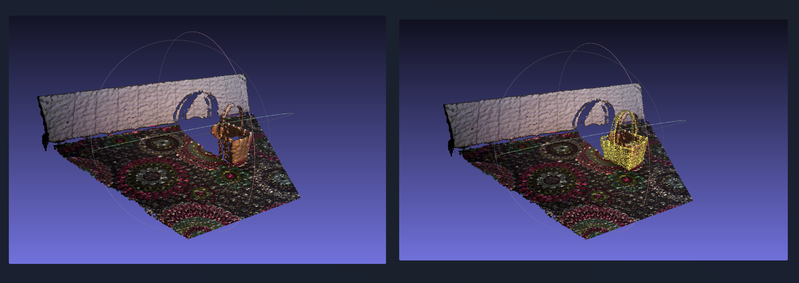

### Surface Matching

The target is to detect the object and calculate the 6D pose in the test
scene. The object model is saved as obj.ply and the scene images are saved in rgb and
depth folder. Afterwards the ADD metric is calculated by comparing with the predicted and
ground truth 6D pose.

Steps:

The process was condensed into three main steps to estimate the object's 6D pose in a scene using OpenCV's PPF detector (https://docs.opencv.org/4.x/d9/d25/group__surface__matching.html):

1. Data Preparation: Loaded the object and scene point clouds, calculated their normals, and combined them to form the input for the PPF3DDetector (cv2.ppf_match_3d_PPF3DDetector) function in OpenCV.

2. PPF Detection: Applied the Point Pari Feature (PPF) detector with fine-tuned parameters to calculate the object 6D pose in the test scene.

3. Accuracy Assessment: Evaluated the predicted pose's accuracy using the Average Distance (ADD) metric by comparing it to a ground truth pose.



### Blender
obj.ply adapted in Blender:

import as .ply file

Modifier Properties --> Add Modifier --> Decimate --> Ratio to 0.025 --> Export as .ply with ASCII enabled

Result: File size reduction from 24,570 KB to 626 KB

### Setup

```
conda create -n sm_ppf python=3.8

conda activate sm_ppf
```

Install all dependencies

```
pip install -r requirements.txt
```´

### Usage

```
python surface_matching.py
```
